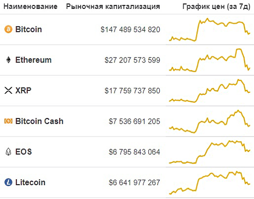
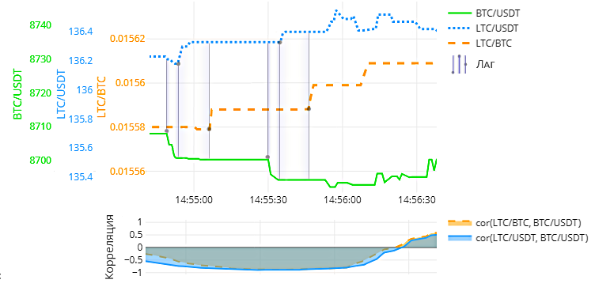
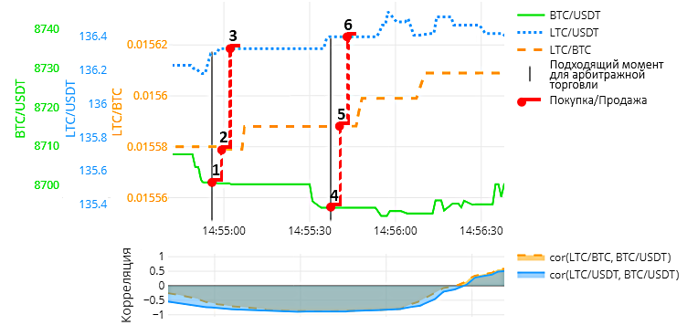
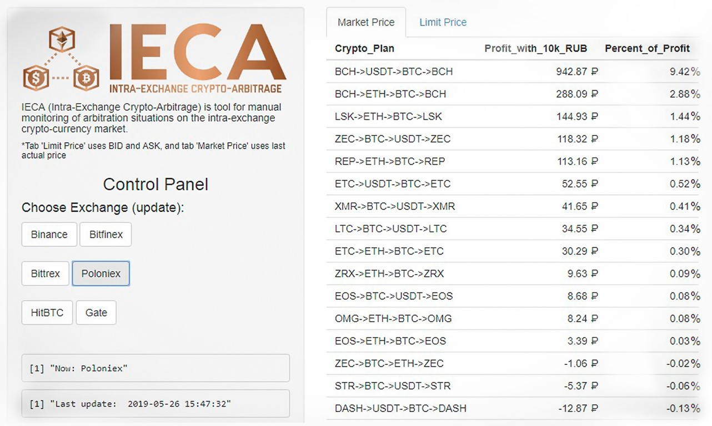
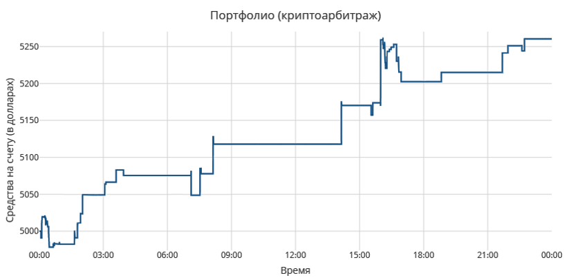

# Intra-Exchange-Crypto-Arbitrage
IECA - Python application for monitoring arbitrage situations between trading pairs inside cryptocurrency exchanges

Since the advent of the cryptocurrency market, Bitcoin has often held a leading position. Its price movements can influence the rates of other cryptocurrencies (altcoins).

While major trends might show positive correlation, shorter timeframes can reveal temporary discrepancies or lags between related trading pairs (e.g., Altcoin/BTC vs. Altcoin/Base vs. BTC/Base).

The picture above illustrates potential rate differences between related pairs like Litecoin/USDT, Litecoin/BTC, and Bitcoin/USDT. These lags, often due to varying trading volumes and market reactions, can create temporary arbitrage opportunities.

An arbitrage trading scheme exploits these temporary price discrepancies between three instruments (a triangular arbitrage).

To describe it, I will give an example based on percentage gain:

Imagine we have an initial amount of a base currency (like BTC or ETH).

1)  We observe a favorable rate to exchange our initial Base currency for Crypto A. We perform the trade, accounting for fees.
2)  Due to market lags, the Crypto A / Crypto B rate might still be favorable. We exchange Crypto A for Crypto B.
3)  Finally, we exchange Crypto B back to our original Base currency. If the price differences were significant enough to overcome transaction fees, we end up with more of the Base currency than we started with, resulting in a percentage profit.

For example, a sequence like `BTC -> ADA -> USDT -> BTC` might yield a small percentage profit if the intermediate rates allow for it after accounting for fees across the three trades.

Monitoring exchanges manually to find these fleeting opportunities across numerous trading pairs is impractical. Therefore, this application was developed to:
1. Fetch current market data (ticker prices) directly from the Binance exchange API.
2. Calculate potential arbitrage profits (as a percentage) for predefined triangular trading paths (e.g., `ADA->BTC->USDT->ADA`).
3. Display the results, highlighting profitable opportunities.

 (Note: Interface may differ slightly from the screenshot)

This tool helps identify *potential* arbitrage situations. Actual execution requires automated trading bots, as these opportunities can appear and disappear within seconds. Backtesting on historical data has shown the potential viability of this approach, although real-world trading involves additional complexities like execution delays and slippage.

This algorithm is based on research originally registered with the Federal Intellectual Property Service ["RosPatent"](https://new.fips.ru/registers-doc-view/fips_servlet?DB=EVM&rn=567&DocNumber=2019615667&TypeFile=html).

Scientific adviser for the original research: [Kozlov Denis Yurievich](mailto:dyk.barnaul@gmail.com).
