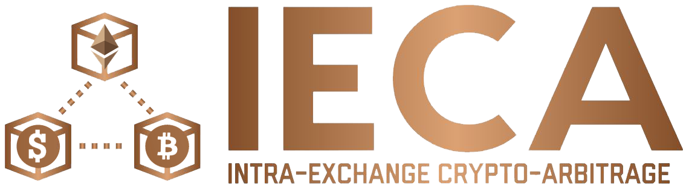
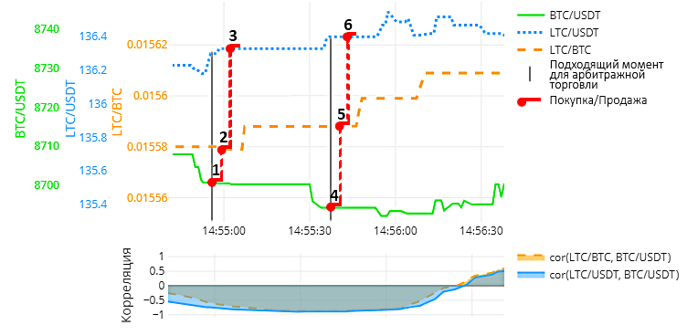

# Intra-Exchange-Crypto-Arbitrage
IECA - Shiny application for monitoring arbitrage situations between trading pairs inside cryptocurrency exchanges

[Russian README](pics/README_Rus.md)

Since the advent of the cryptocurrency market, Bitcoin has always held a leading position in terms of market capitalization. This is due to the fact that it is more popular in the information field than other cryptocurrencies called altcoins.

The growth and decline of the Bitcoin rate presented on the weekly charts lead to similar changes in the altcoin rate,
which indicates the presence of a positive correlation between them. This is due to the fact that Bitcoin sets the mood for the entire cryptocurrency market. A similar picture can be observed on the tick chart, however, it should be borne in mind that periods of negative correlation often appear on lower timeframes, for example, as follows:

The picture above shows the rates of three cryptocurrencies: Bitcoin, Litecoin and Tezer, trading in pairs with each other. It is worth noting immediately that Tezer is a cryptocurrency, designated as USDT and reflecting the maximum price of the dollar, so below, for convenience, I will call it the dollar.

You may notice
that at some points the Litecoin/Dollar and Litecoin/Bitcoin pairs are characterized by a lag in the course relative to Bitcoin / Dollar. This is due to the low daily altcoin trading volume. Based on the delays and dependence of altcoins on Bitcoin, an arbitrage trading scheme is built between the three instruments.

To describe it, I will give an example:

1) Let's say we have funds in dollars (5000 USDT). Imagine that at the moment there is a high coefficient of negative correlation, and the price of Bitcoin is also falling relative to the Dollar, so the first step is to buy it at a more favorable rate (**5000 USDT → 0.57413 BTC**);

2) Due to the negative correlation, the Litecoin/Bitcoin rate will follow upward after the falling Bitcoin/Dollar, however, due to the delays described earlier, we can manage to buy it at a still low rate, so the second step is to buy Litecoin (**0.57413 BTC → 36.8163 LTC**);

3) Since the trading volume of Litecoin/Dollar is greater, than Litecoin/Bitcoin, therefore, there will be less lags in it, which means that the growth of its course will already occur. As the last third step, we sell Lightcoins for Dollars, thereby completing the first arbitrage trading with profit (**36.8163 LTC → 5014.8 USDT - 5000 USDT = 14.8 USDT ~ $ 14.8**).

Steps 4, 5, 6 already refer to the second and is carried out in a similar way.

It is problematic to independently monitor exchanges and find the possibility of arbitrage trading due to the large number of trading instruments, therefore, an adviser was written in the form of a [shiny-web application](https://ieca.shinyapps.io/test/) that receives current rates and issues the optimal trading scheme. 

Since the API of cryptocurrency exchanges changes / updates quite often, some monitors temporarily stopped working. Now you can evaluate the work of the script on the following exchanges: **Bitfinex** and **HitBTC**. Other than that, since arbitrage situations can occur and disappear in a matter of seconds, for safe trading it is necessary to write a robot that was not planned as part of this study.

Backtesting was also conducted for this forecasting method.

Imitation of trade occurred on data for a one-day period. The presence of unprofitable transactions on the chart is explained by delays in their execution, however, their number is small, which indicates the possibility of profitable arbitrage trading between the three instruments of the cryptocurrency market.

In conclusion, I would like to add that this algorithm is [registered](https://new.fips.ru/registers-doc-view/fips_servlet?DB=EVM&rn=567&DocNumber=2019615667&TypeFile=html) with the Federal Intellectual Property Service ["RosPatent"](https://fips.ru).

My scientific adviser [Kozlov Denis Yurievich](mailto:dyk.barnaul@gmail.com) also worked on this research.
