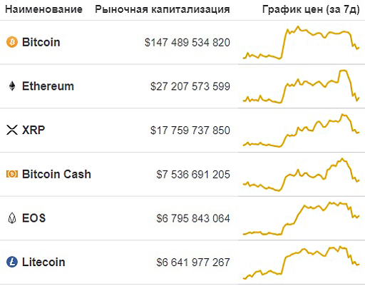
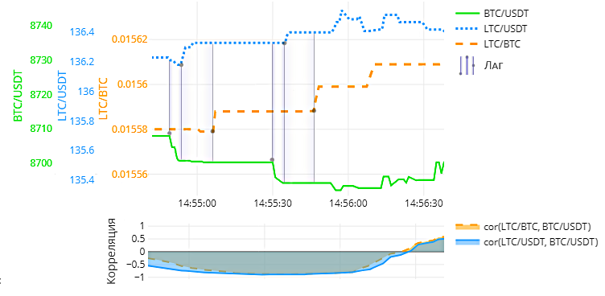
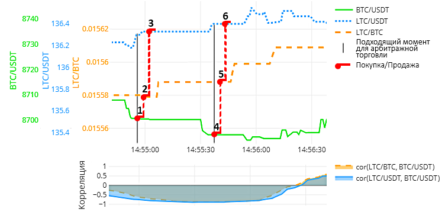
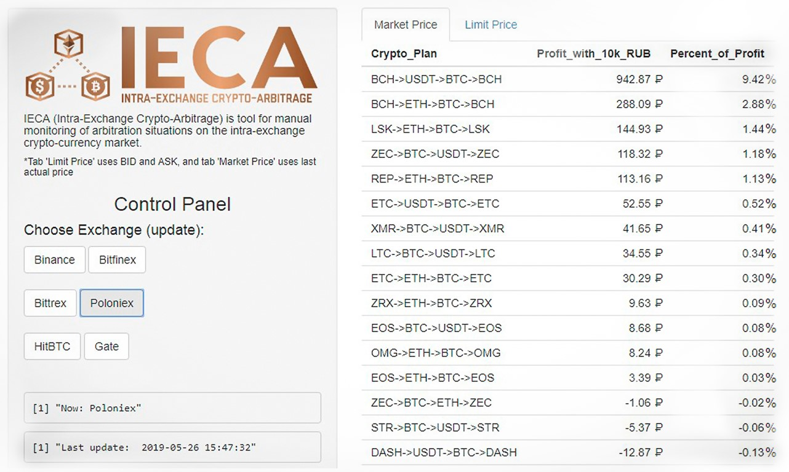
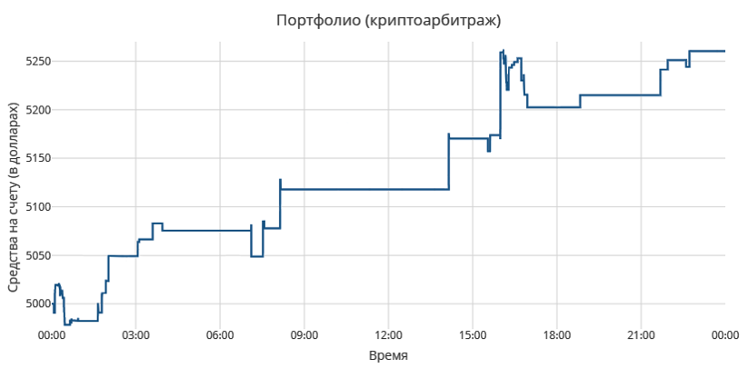

# Intra-Exchange-Crypto-Arbitrage
IECA - Shiny-приложение для мониторинга арбитражных ситуаций между торговыми парами внутри криптовалютных бирж

С момента появления рынка криптовалют Биткоин всегда занимал лидирующие позиции по уровню рыночной капитализации. Это связано с тем, что он более популярен в информационном поле, нежели прочие криптовалюты, называемые альткоинами.

Представленные на недельных графиках рост и падение курса Биткоина приводят к подобным изменениям курса альткоинов, что говорит о наличии положительной корреляции между ними. Это объясняется тем, что Биткоин задает настроение всему рынку криптовалют. Подобную картину можно наблюдать и на тиковом графике, однако стоит учитывать, что на младших таймфреймах часто возникают периоды и отрицательной корреляции, например, как следующий:

На картинке выше показаны курсы трех криптовалют: Биткоин, Лайткоин и Тэзер, торгующихся попарно друг с другом. Стоит сразу заметить, что Тэзер – это криптовалюта, обозначаемая как USDT и максимально отражающая цену доллара, поэтому далее, для удобства, я буду называть ее долларом. 

Можно заметить, что в некоторых моментах для пар Лайткоин/Доллар и Лайткоин/Биткоин характерно запаздывание курса относительно Биткоин/Доллара. Это связано с низким суточным объемом торгов альткоинов. 
Основываясь на запаздываниях и зависимости альткоинов от Биткоина строится схема арбитражной торговли между тремя инструментами.

Для её описания приведу пример:

1)	Допустим у нас имеются средства в долларах (5000 USDT). Представим, что в данный момент высокий коэффициент отрицательной корреляции, а также падает цена Биткоина относительно Доллара, поэтому первым шагом мы покупаем его по более выгодному курсу (**5000 USDT → 0.57413 BTC**);

2)	По причине отрицательной корреляции в след за падающим Биткоин/Долларом вверх устремится курс Лайткоин/Биткоина, однако из-за описанных ранее запаздываний, мы можем успеть приобрести его по еще пока низкому курсу, поэтому вторым шагом мы покупаем Лайткоин (**0.57413 BTC → 36.8163 LTC**);

3)	Так как объемы торгов Лайткоин/Доллара больше, чем у Лайткоин/Биткоина, следовательно запаздывания у него будут меньше, а значит рост его курса уже произойдет. Последним третьим шагом мы продаем Лайткоины за Доллары, тем самым завершая первую арбитражную торговлю с прибылью (**36.8163 LTC → 5014,8 USDT - 5000 USDT = 14,8 USDT ~ $14,8**).

Шаги 4, 5, 6 относятся уже ко второй и проводится аналогичным образом.

Самостоятельно наблюдать за биржами и находить возможность арбитражной торговли проблематично в связи с большим количеством торговых инструментов, поэтому был написан советник в виде [shiny-web-приложения](https://ieca.shinyapps.io/test/), который получает актуальные курсы и выдает оптимальную схему торговли.  

Поскольку API криптовалютных бирж часто измененяются/обновляются, некоторые мониторы временно перестали работать. Теперь вы можете оценить работу скрипта на следующих биржах: **Bitfinex** and **HitBTC**. Кроме этого, так как арбитражные ситуации могут возникать и пропадать за считанные секунды, то для безопасной торговли необходимо написать робота, который в рамках этого исследования не планировался.

Для данного метода прогнозирования был также проведен бэктестинг.

Имитация торговли происходила на данных за однодневный период. Наличие убыточных сделок на графике объясняется задержками в их исполнении, однако их количество невелико, что говорит о возможности прибыльной арбитражной торговли между тремя инструментами криптовалютного рынка.

В заключение я хотел бы добавить, что этот алгоритм [зарегистрирован](https://new.fips.ru/registers-doc-view/fips_servlet?DB=EVM&rn=567&DocNumber=2019615667&TypeFile=html) в Федеральной службе по интеллектуальной собственности ["РосПатент"](https://fips.ru).

Мой научный руководитель [Kozlov Denis Yurievich](mailto:dyk.barnaul@gmail.com) также принимал участие в проведении этого исследования.
